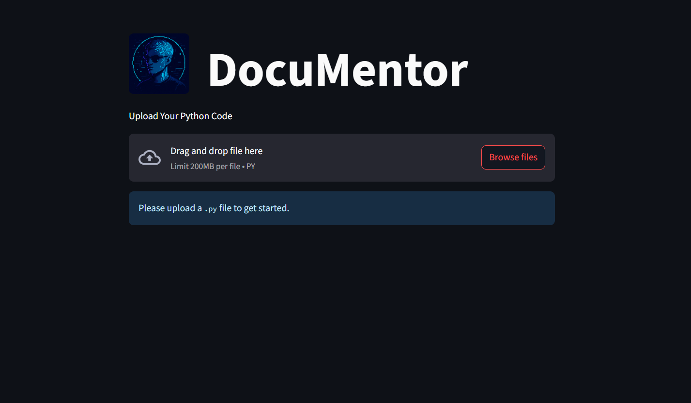
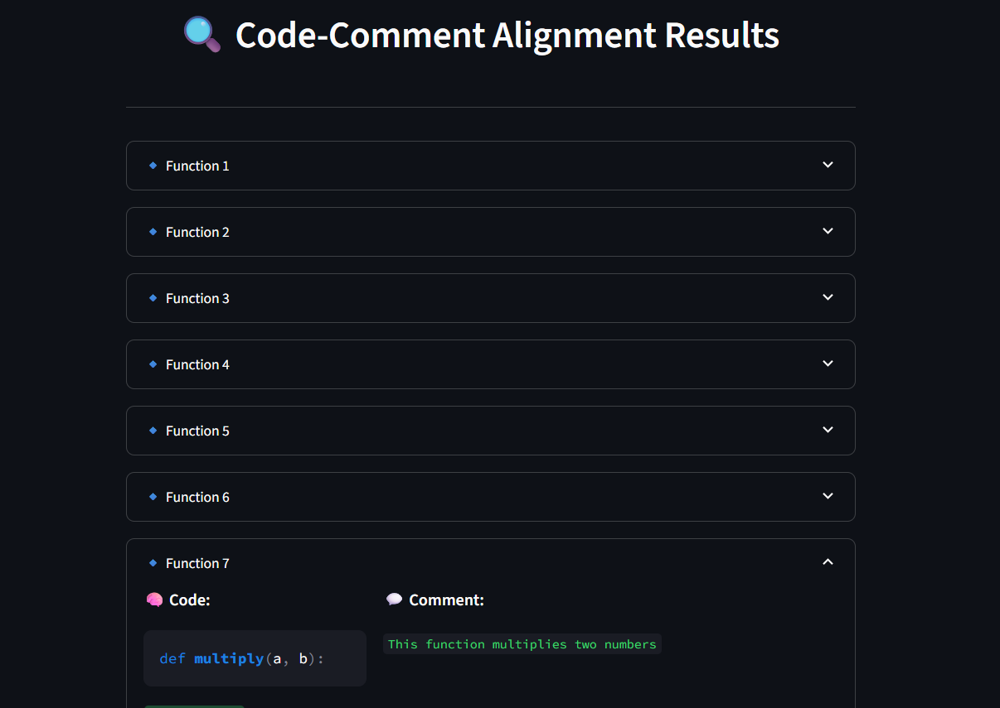
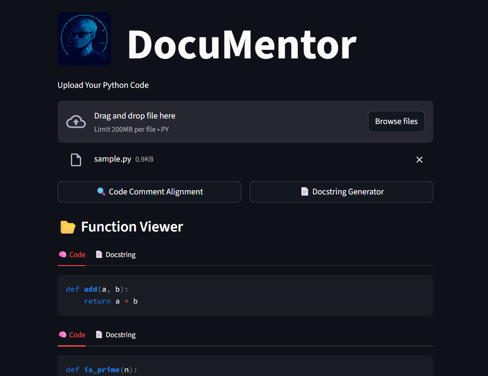

# 🚀 DocuMentor

>**DocuMentor** — your AI-powered code reviewer that keeps comments honest and crafts docstrings like a senior developer.

---

## 📝 Description
DocuMentor is an AI-driven developer assistant that **checks code comment alignment** using a fine-tuned **CodeBERT** model and **generates high-quality docstrings** with the help of advanced Large Language Models (LLMs).  
It ensures your code documentation is accurate, consistent, and professional — making your codebase easier to maintain, review, and scale.

---

## ✨ Features
- ✅ **Automatic Code-Comment Analysis** — Detects poor or misaligned code comments.
- 📝 **AI-Powered Docstring Generation** — Generates high-quality, PEP 257-compliant docstrings.
- ⚡ **FastAPI Backend** — High-performance API server for processing.
- 🌐 **Streamlit Frontend** — Clean, interactive UI for easy use.
- 🐳 **Docker Support** — Simple containerized deployment.
- 📊 **Real-Time Processing** — Works instantly on uploaded files.

---

## 🖥️ Demo
<!-- Add a GIF or Screenshot -->

  


## 🚀 Live Demo
[Try DocuMentor here](your-streamlit-link) – Fully functional Streamlit UI version (includes all logic internally for deployment purposes).

> Note: The project also has a FastAPI backend that can be run locally.  
> Due to deployment size constraints, the deployed demo uses the backend logic embedded directly into the Streamlit app.


---

## 🏗️ Tech Stack
**Frontend:** Streamlit  
**Backend:** FastAPI  
**ML Models:** Hugging Face Transformers, CodeBert
**Others:** Docker, Python 3.10+


---

## 📂 Project Structure
```plaintext
assets/

main/
├── __init__.py
│
├── backend/
│   ├── Dockerfile
│   ├── __init__.py
│   │
│   ├── app/
│   │   ├── server.py
│   │   └── __init__.py
│   │
│   └── utils/
│       ├── code_comment_extractor.py
│       ├── modelhelper_code_alignment.py
│       ├── modelhelper_docstring_gen.py
│       ├── sample.py
│       └── __init__.py
│
├── frontend/
│   └── ui.py
│
└── resources/
